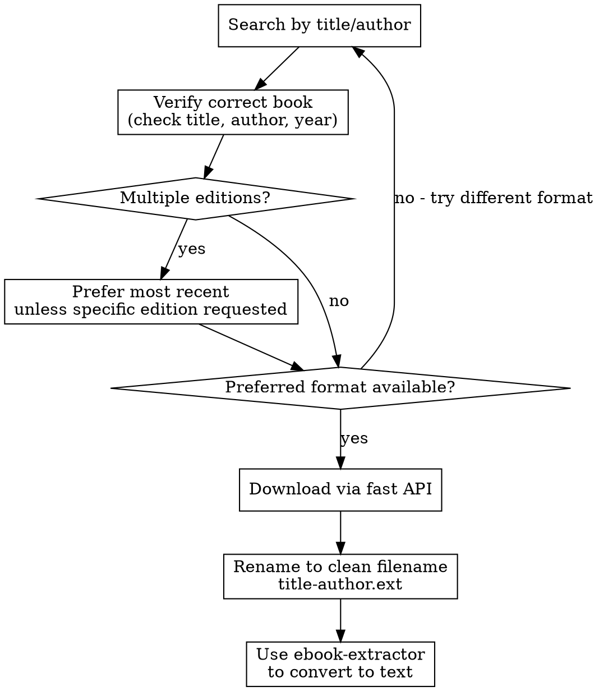

# Anna's Archive Ebook Lookup & Download

## Overview

Search and download ebooks from Anna's Archive, which indexes millions of books across formats (PDF, EPUB, MOBI, etc.).

## Prerequisites

**Automated downloads require an Anna's Archive membership key.** Search always works without a key.

If a key is set, fast downloads work automatically. If no key is set or the key is invalid, the script will:
1. Show a direct link to the book's page for manual download in a browser
2. Explain that free slow downloads require a captcha and can't be automated
3. Encourage supporting Anna's Archive with a membership (starts at $2)

**To set up automated downloads:**
1. [Donate at Anna's Archive](https://annas-archive.gl/donate?r=7XfHurr)
2. Find your key in Account Settings
3. Set: `export ANNAS_ARCHIVE_KEY="your-key"`

## When to Use

- User asks to find/download a book
- Need to look up content from a published book
- Searching for a specific edition or format
- "Get me the PDF of Clean Code"
- "Find the latest edition of Design Patterns"

## Quick Reference

| Task | Command |
|------|---------|
| Search | `python3 annas.py search "query" --format pdf` |
| Get details | `python3 annas.py details <md5>` |
| Download | `python3 annas.py download <md5> --output /path/` |
| Verify match | `python3 annas.py search "title author" --verify "expected title"` |

## Environment Setup

```bash
export ANNAS_ARCHIVE_KEY="your-membership-key"
```

The key is found in your Anna's Archive account settings.

## Workflow



## Common Patterns

### Find and download a book
```bash
# Search with format preference
python3 annas.py search "Clean Code Robert Martin" --format pdf --limit 5

# Verify it's the right book, get details
python3 annas.py details adb5293cf369256a883718e71d3771c3

# Download
python3 annas.py download adb5293cf369256a883718e71d3771c3 --output ./books/

# REQUIRED: Rename to a clean filename using glob + md5
mv ./books/*adb5293cf369256a* ./books/clean-code-robert-martin.pdf
```

### Handle multiple editions
When search returns multiple editions:
1. Check year - prefer most recent unless user specified edition
2. Check format - match user's preference (pdf/epub)
3. Verify author matches exactly

### Format Priority
Default priority when user doesn't specify: `pdf > epub > mobi > azw3 > djvu`

## API Details

**Search endpoint:** `https://annas-archive.gl/search`
- `q` - query string
- `ext` - format filter (pdf, epub, mobi, azw3, djvu)
- `sort` - `year_desc` for most recent first

**Fast download API:** `https://annas-archive.gl/dyn/api/fast_download.json`
- `md5` - book identifier
- `key` - from ANNAS_ARCHIVE_KEY env var

**Manual download page:** `https://annas-archive.gl/md5/<md5>`
- Shows both fast and slow download options
- Slow downloads are free but require solving a captcha in a browser

## REQUIRED: Rename After Download

**Always rename downloaded files immediately.** Anna's Archive filenames are long, contain unicode characters that break shell commands, and are generally unusable.

### Naming convention: `title-author.ext`
- Lowercase
- Hyphens between words
- Title and author only, no year/publisher/md5
- Keep the original extension

### How to rename
Use the MD5 hash with a glob to find the file (never type the original filename):
```bash
mv /tmp/books/*729a66f87a5a6*.pdf /tmp/books/atomic-habits-james-clear.pdf
```

### Examples
| Original (Anna's Archive) | Renamed |
|---|---|
| `Atomic Habits_ The life-changing... -- Anna\u2019s Archive.pdf` | `atomic-habits-james-clear.pdf` |
| `Clean Code_ A Handbook of... -- Anna\u2019s Archive.epub` | `clean-code-robert-martin.epub` |
| `Design Patterns_ Elements of... -- Anna\u2019s Archive.pdf` | `design-patterns-gang-of-four.pdf` |

### Why this is required
Anna's Archive filenames contain unicode right single quotation marks (`\u2019`) that look identical to ASCII apostrophes but aren't. This causes silent failures in `cp`, `mv`, `cat`, and every other shell command. AI agents consistently fail to handle these filenames. Renaming immediately eliminates the problem.

## Common Mistakes

| Mistake | Fix |
|---------|-----|
| Key not set | Check `echo $ANNAS_ARCHIVE_KEY` |
| Wrong edition | Use `--verify` flag with expected title |
| Format mismatch | Explicitly set `--format` |
| Book not found | Try shorter query, author name variations |
| File not found after download | Filenames have unicode chars - use glob with md5: `ls *<md5>*` |

## Converting to Text

Downloaded files are in their original format (PDF, EPUB, MOBI, etc.). To convert to plain text for analysis or processing, use the **ebook-extractor** skill after downloading.

Typical workflow:
1. Download with this skill → `books/Clean_Code.pdf`
2. Convert with ebook-extractor → `books/Clean_Code.txt`

## Partner Host Outages (downloads failing with 403/404)

Fast downloads route through rotating partner file hosts. When downloads fail with
nginx 404s or 403 stub pages but the md5 page loads fine, the hosts have changed or
are down — the catalog still lists the file, the mirrors just don't serve it.

**To discover the current host list:**

1. Open any known-file md5 page in a real browser: `https://annas-archive.gl/md5/<md5>`
2. Scrape all fast-download link indexes from the HTML: `/fast_download/<md5>/<path_index>/<domain_index>`
3. Map each `domain_index` to its hostname by querying the API per index:
   `https://annas-archive.gl/dyn/api/fast_download.json?md5=<md5>&key=<key>&domain_index=N`
   (invalid indexes return `Invalid domain_index or path_index`; valid ones return a
   `download_url` whose hostname IS that index's current server)

Known host map (verified 2026-08-24, re-verify when failures cluster):

| domain_index | Host |
|---|---|
| 0, 3 | wtgadtq.org |
| 1, 4 | hxd7ms.org |
| 2, 5 | momot.rs |
| 6, 10 | yqrii5.org |
| 7, 11 | wbsg8v.xyz |
| 8, 12 | b4mcx2ml.net |
| 9, 13 | asuycdg6.org |

Hostnames are ephemeral (auto-generated when Anna's rotates partners); the INDEXES
are stable. Never hardcode trust in a hostname — always re-map via step 3.

Note: DDoS-Guard challenges scripted page fetches on deep paths after ~10 requests
regardless of cookie freshness. Fetch pages through a real Chrome (CDP or headed) and
reserve plain HTTP for `fast_download.json` + partner file bytes only.

## DDoS-Guard on Search and Detail Pages

Verified 2026-09-11: every mirror answers `/search` from a script with a DDoS-Guard check
page (403 at `?check=1`). Plain HTTP, a cookie jar, and headless Chromium (`agent-browser`,
even after a 25-second wait) all stay on the check page.

What works is the nodriver stealth browser in `~/Projects/others/stealth-browser-mcp`, which
opens a headed Chrome. `annas.py` falls back to it on any 403 page fetch, so `search` and
`details` work as before, with a Chrome window per fetch. `fast_download.json` and the file
bytes still work over plain HTTP with the key.

If the fallback prints nothing, check that `~/Projects/others/stealth-browser-mcp/venv/bin/python`
exists and can `import nodriver`.

## Mirror Fallback

The `.org` domain is defunct. `.li` and `.pm` are parked pages that return 200 with no
results, and `.in` does not answer. The script tries these mirrors in order:
- annas-archive.gl (primary)
- annas-archive.gd
- annas-archive.pk

If all known mirrors fail, the script checks the status page at https://open-slum.pages.dev/ to discover new mirror domains automatically.

The first working mirror is cached for the session. You'll see `Using mirror: <domain>` in stderr when a fallback is used.

## Error Handling

- **"Invalid md5"** - MD5 hash is malformed or doesn't exist
- **"Not a member"** - Key is invalid or expired
- **No results** - Broaden search terms, try author-only search
- **"Could not connect to any mirror"** - All mirrors are down, try again later

## Troubleshooting

### SSL Certificate Error on macOS

If you see this error:
```
[SSL: CERTIFICATE_VERIFY_FAILED] certificate verify failed: unable to get local issuer certificate
```

This happens because Python can't find the system's CA certificate bundle on macOS.

**Quick Fix:**

1. Install certifi:
   ```bash
   pip3 install certifi
   ```

2. Find your certificate path:
   ```bash
   python3 -c "import certifi; print(certifi.where())"
   ```

3. Add to `~/.zshrc`:
   ```bash
   export SSL_CERT_FILE=/path/from/step/2/cacert.pem
   ```

4. Reload shell: `source ~/.zshrc`

**Verify it works:**
```bash
python3 -c "import urllib.request; urllib.request.urlopen('https://google.com')"
```

**Why this happens:** macOS uses Keychain for certificates, but Python doesn't use it by default. Framework installs (like `/Library/Frameworks/Python.framework`) often lack certificate configuration.

**Do NOT** use `verify=False` or `PYTHONHTTPSVERIFY=0` - this disables SSL entirely and is insecure.
