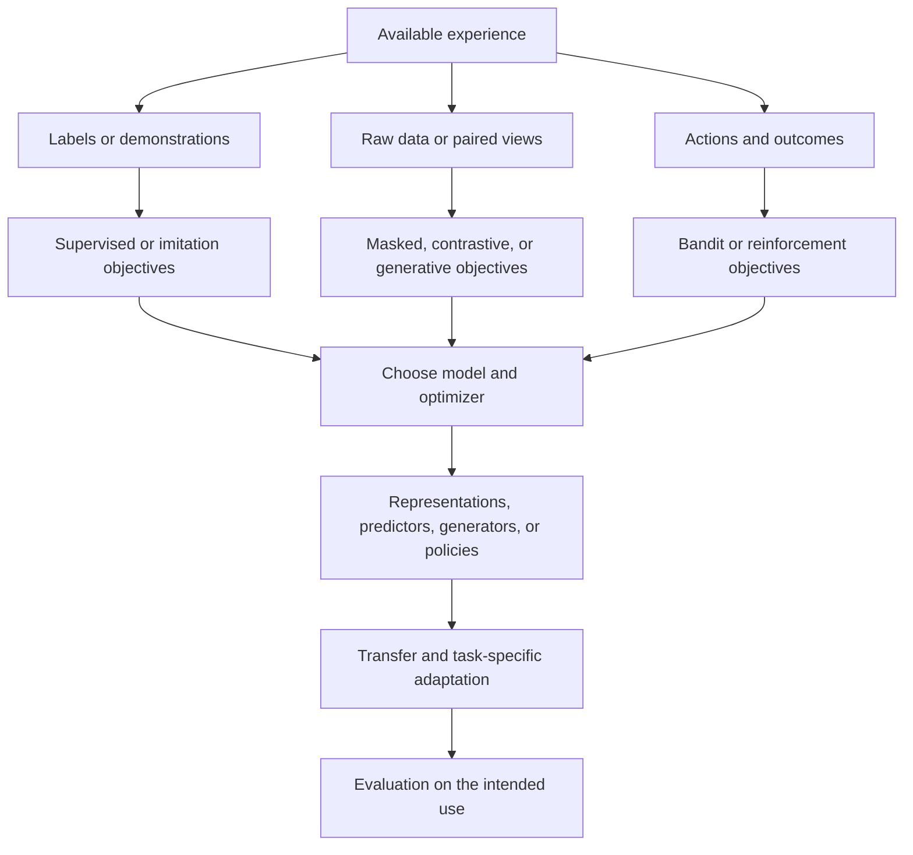

# A map of machine learning

Machine learning changes a model using experience so that it can make useful predictions, represent data, generate samples, or choose actions. The difficult part is choosing what counts as a useful learning signal. A model usually optimizes a measurable surrogate—prediction error, similarity, likelihood, or reward—while we care about performance on new situations.

There is no single family tree of “all types of ML.” The familiar labels answer different questions. **Supervised** describes where a target comes from. **Masked prediction** describes a task. **Transformer** describes a model architecture. **Adam** describes an optimizer. **Fine-tuning** describes a training stage. One system can use all five. The Transformer and Adam papers concern separate parts of this construction.[^38][^58]

This chapter defines the axes. The later chapters examine their mechanisms and tradeoffs. Practical examples and decision rules are synthesis, not claims that one taxonomy is universally accepted.

## Contents

- [Seven axes](#seven-axes)
- [The learning signals](#the-learning-signals)
- [A shared mathematical language](#a-shared-mathematical-language)
- [How real systems combine methods](#how-real-systems-combine-methods)
- [Architecture and optimization](#architecture-and-optimization)
- [Terms that cause confusion](#terms-that-cause-confusion)

## Seven axes

| Axis | Question | Examples |
| --- | --- | --- |
| Supervision | What tells the learner it is doing well? | Human labels, hidden parts of data, paired modalities, demonstrations, preferences, rewards |
| Objective | What mathematical task does it optimize? | Regression, classification, ranking, reconstruction, contrastive matching, likelihood, cumulative return |
| Model family | What functions or distributions can it express? | Linear models, trees, kernels, graphical models, neural networks |
| Architecture | How is a particular model organized? | CNN, Transformer, recurrent network, graph network, encoder–decoder |
| Optimization/inference | How are its parameters or latent variables estimated? | Closed-form least squares, SGD, Adam, EM, variational inference, MCMC |
| Training setting | Where and when does learning happen? | Pretraining, fine-tuning, multitask, online, continual, federated |
| Evaluation/use | What will the learned object be asked to do? | Frozen-feature classification, retrieval, forecasting, generation, planning, causal estimation |

These axes overlap. A Gaussian process is both a model family and a Bayesian prior over functions. A VAE specifies a latent-variable model and a variational learning procedure. An RL algorithm often combines a policy architecture, value-estimation objective, data-collection strategy, and optimizer.[^73][^25][^75]

The arrows show compatible combinations, not exclusive definitions. Human-labeled examples can train a contrastive loss; rewards can train a language model; unlabeled video can train the representations used by a robot policy.

## The learning signals

| Family | Available signal | Main advantage | Main assumption or weakness |
| --- | --- | --- | --- |
| Supervised | Examples paired with desired targets | Direct connection to a defined task | Labels and sampled cases must represent deployment |
| Unsupervised | Structure in observations | Finds patterns without task labels | Structure may not correspond to useful concepts |
| Self-supervised | Targets constructed from observations | Uses abundant raw data | The constructed task must encourage useful information |
| Semi-supervised | Some labeled, many unlabeled examples | Can reduce labeling needs | Unlabeled structure must be relevant to the labeled task |
| Weakly supervised | Noisy, coarse, heuristic, or indirect labels | Acquires supervision cheaply | Bias and correlation among labeling sources can dominate |
| Reinforcement | Rewards after actions | Optimizes behavior over consequences | Exploration, delayed credit, reward quality, and coverage are difficult |
| Imitation | Demonstrations of behavior | Starts from useful actions | Demonstrations may not cover states the learner visits |
| Preference-based | Comparisons between outcomes | Useful when ratings are easier than exact targets | Preferences may conflict or reward superficial features |

The boundaries are conventions. Self-supervised learning is often treated as part of unsupervised learning because it needs no externally supplied task labels. Its actual loss can still be ordinary supervised cross-entropy. Semi-supervised describes the overall data setup: FixMatch combines labeled cross-entropy with pseudo-labels from unlabeled images. Snorkel instead combines noisy labeling functions, a weak-supervision setup.[^34][^35]

**Active learning** adds a data-acquisition decision: which example should receive a label next? It can accompany supervised or semi-supervised training. **Transfer learning** reuses learning from another task or dataset. **Continual learning** asks how to incorporate new experience while retaining old abilities. These are additional dimensions, not competitors to supervised learning.[^74][^4][^46]

## A shared mathematical language

For many predictive methods, a useful template is

$$
\theta^*=\arg\min_\theta\;\mathbb E_{(x,y)\sim D}
[\ell(f_\theta(x),y)]+\lambda\Omega(\theta).
$$

Here, $x$ is input, $y$ is a target, $D$ is the data distribution, $f_\theta$ is the model, $\ell$ is the loss, and $\Omega$ is a regularizer weighted by $\lambda$. In practice we estimate the expectation using finite data. The formula specifies what to optimize; it does not specify whether to use a tree, a neural network, or a kernel method.[^76]

For self-supervision, build $y$ from $x$. Let $c(x)$ corrupt or transform the input, and let $t(x)$ construct the target:

$$
\mathcal L_{\mathrm{self}}=
\mathbb E_x\mathbb E_c\big[\ell(f_\theta(c(x)),t(x))\big].
$$

The target may be a hidden word, missing pixels, a discrete code, or another network's features. The raw dataset supplies both sides of the example. Denoising autoencoders, masked language models, and data2vec instantiate different choices of corruption and target.[^71][^1][^10]

For reinforcement learning, actions influence future observations. A standard objective is

$$
\max_\theta\;J(\theta)=
\mathbb E_{\tau\sim\pi_\theta}\left[\sum_{t=0}^{T}\gamma^t r_t\right].
$$

$\pi_\theta$ is a policy, $\tau$ a trajectory generated by acting, $r_t$ reward, and $\gamma$ a discount factor. Training can change the data distribution by changing the policy. This feedback distinguishes RL from fitting a predictor to an independent, fixed sample.[^75]

The common question is: **why should improving this objective improve the thing we actually need?** A reconstruction loss can favor texture over category. A click reward can favor curiosity over satisfaction. A classifier can use a background cue that disappears after deployment. Shortcut learning documents how benchmark success can coexist with failures under changed conditions.[^60]

## How real systems combine methods

| System | Training signal and objective | Architecture or model | Reuse and final use |
| --- | --- | --- | --- |
| Original BERT | Self-supervised masked tokens plus next-sentence prediction | Bidirectional Transformer encoder | Supervised fine-tuning for language-understanding tasks |
| Original MAE | Self-supervised prediction of hidden image pixels | Vision Transformer encoder with a smaller decoder | Transfer the encoder; add and train a task head |
| CLIP | Match naturally paired images and text with a contrastive objective | Image encoder and text encoder | Retrieval and classification through text descriptions |
| Instruction-tuned language model | Autoregressive pretraining, demonstrations, then possibly preference or reward optimization | Usually a language-generating neural architecture | Prompted generation; optional further adaptation |
| TabPFN | Learn across synthetic tabular prediction problems | Transformer | Condition on a new labeled table to predict its missing labels |
| Dreamer | Learn dynamics from experience and improve a policy through imagined trajectories | Learned world model, actor, and critic | Sequential control |

These are representative published systems, not a ranking.[^1][^2][^20][^51][^78][^53]

The same image collection illustrates the distinctions. Predict expert-provided species labels and the task is supervised. Hide patches and reconstruct them and it is self-supervised masked prediction. Cluster image features and it is unsupervised structure discovery. Ask an expert to label the most informative remaining images and you have added active learning. Train on several institutions' local image collections without collecting their raw images centrally and you have added a federated setting.

None of those choices determines whether the model must be a Transformer. None guarantees that the result will recognize a new species or work with a different camera.

## Architecture and optimization

**Linear and generalized linear models** offer a constrained relationship between features and predictions. **Trees** partition feature space. **Kernels** express similarity and can support nonlinear prediction without explicitly constructing a large feature vector. These inductive biases can be well suited to limited or structured datasets.[^76]

**CNNs** reuse filters over space, expressing useful assumptions about local patterns. **Recurrent networks** update state through a sequence. **Transformers** use attention to mix information across positions; their attention pattern can be bidirectional, causal, or otherwise restricted. A Vision Transformer represents images as patch sequences. **Graph networks** aggregate information over neighbors or relations. Each can support multiple objectives.[^39][^38][^40][^41]

**Encoder** and **decoder** describe roles and sometimes specific architecture conventions. A BERT encoder produces contextual token features. An MAE decoder reconstructs patches. A language-model decoder predicts tokens under an attention restriction. The shared word does not make these components interchangeable.

**Backpropagation** computes gradients through a differentiable computation. **SGD** uses gradient estimates to update parameters; **Adam** rescales updates using moving statistics of gradients. They do not specify the supervision source. The classic backpropagation paper shows how error gradients train internal representations.[^98] A model can use the same optimizer for labeled classification, masked prediction, or a policy-gradient objective.[^58]

**Expectation–maximization** alternates latent-variable estimation and parameter fitting. **Variational inference** optimizes an approximation to a posterior. **MCMC** approximates posterior expectations with samples. These connect statistical inference and learning; they should not be forced into a list of neural pretraining objectives.[^77][^25][^73]

## Terms that cause confusion

| Term | Precise distinction |
| --- | --- |
| Generative | Can describe modeling a data distribution; practical generation also needs a sampling procedure |
| Discriminative | Usually predicts targets or boundaries directly; a self-supervised objective can be discriminative |
| Representation learning | Learns features for reuse; supervised, contrastive, reconstructive, and generative training can all do it |
| Deep learning | Uses layered neural representations; does not imply a particular supervision source |
| Foundation model | Broadly pretrained and reusable; describes scope and reuse, not a unique loss |
| Zero-shot | No task-specific labeled examples in the stated evaluation protocol; does not mean no prior training |
| Few-shot | Few task examples; specify whether they are used for gradient updates or only provided in context |
| Online | Can mean streaming parameter updates or fresh environment interaction; state which |
| Offline RL | Policy learning from fixed logged interactions; more specific than training any model offline |
| Self-training | Creates targets from a learner's predictions; can reinforce existing errors |
| Self-distillation | Uses a related teacher to supervise a student; teacher updates and collapse prevention matter |
| World model | Predicts some aspect of environment dynamics; usefulness for planning requires further evidence |

For a new term, locate its axis, write one concrete input–target pair, and identify what is updated. Those three steps usually dissolve the apparent taxonomy problem.

## Notation and useful connections

| Notation | Meaning |
| --- | --- |
| $\theta$ | Parameters fitted by learning |
| $\mathbb E$ | Average with respect to the stated random variables |
| $\nabla_\theta$ | Gradient with respect to parameters; a local direction of change |
| $\arg\min$ | The argument that minimizes an objective |
| $p(y\mid x)$ | Conditional distribution of $y$ given $x$ |
| $-\log p(y\mid x)$ | Negative log likelihood of the observed target |
| $\|a-b\|^2$ | Squared Euclidean difference, when that norm is used |
| $\operatorname{KL}(q\|p)$ | Expected log ratio $\mathbb E_q\log(q/p)$; a nonnegative, asymmetric divergence |
| $\operatorname{sg}$ | Stop-gradient: use a value while blocking a derivative through that branch |

Cross-entropy with a fixed target distribution equals that distribution's entropy plus its KL divergence from the predicted distribution. Minimizing one therefore minimizes the other up to a target-dependent constant. This explains why apparently different objectives can be algebraically related while their data construction and model roles remain different.

An $L_2$ parameter penalty can correspond to a Gaussian-prior maximum-a-posteriori estimate under a compatible likelihood and scaling. That connection does not make a single penalized estimate equivalent to averaging over a Bayesian posterior. Likewise, a linear reconstruction bottleneck can recover a PCA subspace without uniquely recovering named latent coordinates.[^73][^99]

The broader distinction is between **objective equivalence**, **parameterization equivalence**, and **algorithmic equivalence**. Two losses can have related optimum distributions while producing different finite-data behavior, optimization difficulty, and serving cost. Look for all three before calling two techniques “the same.”

## Sources

[^38]: Ashish Vaswani; Noam Shazeer; Niki Parmar; et al. [Attention Is All You Need](https://arxiv.org/abs/1706.03762). 2017-06-12.

[^58]: Diederik P. Kingma; Jimmy Ba. [Adam: A Method for Stochastic Optimization](https://arxiv.org/abs/1412.6980). 2014-12-22.

[^73]: Carl Edward Rasmussen; Christopher K. I. Williams. [Gaussian Processes for Machine Learning](https://gaussianprocess.org/gpml/). 2006.

[^25]: Diederik P Kingma; Max Welling. [Auto-Encoding Variational Bayes](https://arxiv.org/abs/1312.6114). 2013-12-20.

[^75]: Richard S. Sutton; Andrew G. Barto. [Reinforcement Learning: An Introduction, second edition](http://incompleteideas.net/book/the-book-2nd.html). 2018.

[^34]: Kihyuk Sohn; David Berthelot; Chun-Liang Li; et al. [FixMatch: Simplifying Semi-Supervised Learning with Consistency and Confidence](https://arxiv.org/abs/2001.07685). 2020-01-21.

[^35]: Alexander Ratner; Stephen H. Bach; Henry Ehrenberg; et al. [Snorkel: Rapid Training Data Creation with Weak Supervision](https://arxiv.org/abs/1711.10160). 2017-11-28.

[^74]: Burr Settles. [Active Learning Literature Survey](https://burrsettles.com/pub/settles.activelearning.pdf). 2009; revised 2010.

[^4]: Colin Raffel; Noam Shazeer; Adam Roberts; et al. [Exploring the Limits of Transfer Learning with a Unified Text-to-Text Transformer](https://arxiv.org/abs/1910.10683). 2019-10-23.

[^46]: James Kirkpatrick; Razvan Pascanu; Neil Rabinowitz; et al. [Overcoming catastrophic forgetting in neural networks](https://arxiv.org/abs/1612.00796). 2016-12-02.

[^76]: scikit-learn contributors. [1. Supervised learning](https://scikit-learn.org/stable/supervised_learning.html). Living documentation; accessed 2026-09-11.

[^71]: Pascal Vincent; Hugo Larochelle; Isabelle Lajoie; et al. [Stacked Denoising Autoencoders: Learning Useful Representations in a Deep Network with a Local Denoising Criterion](https://www.jmlr.org/papers/v11/vincent10a.html). 2010.

[^1]: Jacob Devlin; Ming-Wei Chang; Kenton Lee; et al. [BERT: Pre-training of Deep Bidirectional Transformers for Language Understanding](https://arxiv.org/abs/1810.04805). 2018-10-11.

[^10]: Alexei Baevski; Wei-Ning Hsu; Qiantong Xu; et al. [data2vec: A General Framework for Self-supervised Learning in Speech, Vision and Language](https://arxiv.org/abs/2202.03555). 2022-02-07.

[^60]: Robert Geirhos; Jörn-Henrik Jacobsen; Claudio Michaelis; et al. [Shortcut Learning in Deep Neural Networks](https://arxiv.org/abs/2004.07780). 2020-04-16.

[^2]: Kaiming He; Xinlei Chen; Saining Xie; et al. [Masked Autoencoders Are Scalable Vision Learners](https://arxiv.org/abs/2111.06377). 2021-11-11.

[^20]: Alec Radford; Jong Wook Kim; Chris Hallacy; et al. [Learning Transferable Visual Models From Natural Language Supervision](https://arxiv.org/abs/2103.00020). 2021-02-26.

[^51]: Long Ouyang; Jeff Wu; Xu Jiang; et al. [Training language models to follow instructions with human feedback](https://arxiv.org/abs/2203.02155). 2022-03-04.

[^78]: Noah Hollmann; Samuel Müller; Lennart Purucker; et al. [Accurate predictions on small data with a tabular foundation model](https://www.nature.com/articles/s41586-024-08328-6). 2025-01-08.

[^53]: Danijar Hafner; Jurgis Pasukonis; Jimmy Ba; et al. [Mastering Diverse Domains through World Models](https://arxiv.org/abs/2301.04104). 2023-01-10.

[^39]: Kaiming He; Xiangyu Zhang; Shaoqing Ren; et al. [Deep Residual Learning for Image Recognition](https://arxiv.org/abs/1512.03385). 2015-12-10.

[^40]: Alexey Dosovitskiy; Lucas Beyer; Alexander Kolesnikov; et al. [An Image is Worth 16x16 Words: Transformers for Image Recognition at Scale](https://arxiv.org/abs/2010.11929). 2020-10-22.

[^41]: William L. Hamilton; Rex Ying; Jure Leskovec. [Inductive Representation Learning on Large Graphs](https://arxiv.org/abs/1706.02216). 2017-06-07.

[^98]: David E. Rumelhart; Geoffrey E. Hinton; Ronald J. Williams. [Learning representations by back-propagating errors](https://doi.org/10.1038/323533a0). 1986-10-09.

[^77]: scikit-learn contributors. [2. Unsupervised learning](https://scikit-learn.org/stable/unsupervised_learning.html). Living documentation; accessed 2026-09-11.

[^99]: Pierre Baldi; Kurt Hornik. [Neural Networks and Principal Component Analysis: Learning from Examples Without Local Minima](https://www.igb.uci.edu/~pfbaldi/publications/journals/1989/NN_and_PCA.pdf). 1989.
